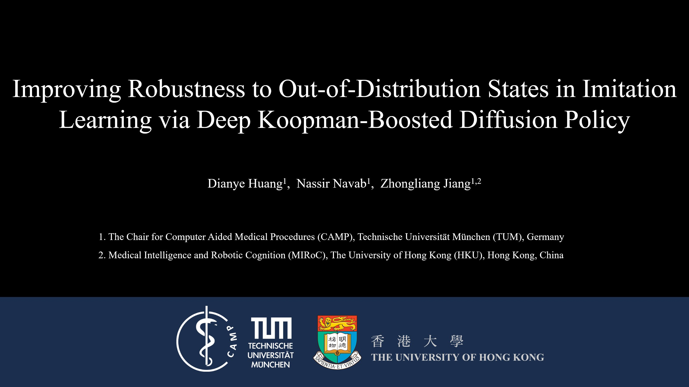

# Deep Koopman-boosted Dual-branch Diffusion Policy for Imitation Learning
<div align="left">
  <a href="https://www.cs.cit.tum.de/en/camp/members/dianye-huang/">Dianye Huang</a>, <a href="https://www.cs.cit.tum.de/camp/members/cv-nassir-navab/nassir-navab/">Nassir Navab</a>, <a href="https://mech.hku.hk/academic-staff/jiang-z-l/">Zhongliang Jiang</a>
</div>
<div align="left">
  Technical University of Munich <span style="margin: 0 10px;">•</span> The University of Hong Kong
</div>

<br>

This repository contains the implementation of the paper “Deep Koopman-boosted Dual-branch Diffusion Policy for Imitation Learning.”  [<u>*ArXiv*</u>](https://arxiv.org/abs/2511.00555)

<div align="center">
    <a href="https://www.youtube.com/watch?v=Z3XBALCsUwA" target="_blank">
        
    </a>
</div>

## Installation

The repository has been tested on `Ubuntu 20.04` using `Python 3.8.13`.

### 1. Install RLBench
Refer to the [RLBench_ACT repository](https://github.com/Boxjod/RLBench_ACT?tab=readme-ov-file) for detailed setup instructions.  
Download the official [CoppeliaSim Ubuntu 20.04 package](https://www.coppeliarobotics.com/files/V4_1_0/CoppeliaSim_Edu_V4_1_0_Ubuntu20_04.tar.xz).

#### Automatically install CoppeliaSim

```bash
mkdir -p $COPPELIASIM_ROOT && tar -xf CoppeliaSim_Edu_V4_1_0_Ubuntu20_04.tar.xz -C $COPPELIASIM_ROOT --strip-components 1
ln -s $COPPELIASIM_ROOT/libcoppeliaSim.so $COPPELIASIM_ROOT/libcoppeliaSim.so.1
```

#### Add environment variables
Add the following lines to your `~/.bashrc` file:

```bash
export COPPELIASIM_ROOT=~/COPPELIASIM  # Adjust this path if needed
export LD_LIBRARY_PATH=$COPPELIASIM_ROOT:$LD_LIBRARY_PATH
export QT_QPA_PLATFORM_PLUGIN_PATH=$COPPELIASIM_ROOT
```

Then apply the changes:
```bash
source ~/.bashrc
```

#### Test your CoppeliaSim installation:

```bash
bash $COPPELIASIM_ROOT/coppeliaSim.sh
```

### 2. Environment setup

#### Create conda environment
```bash
conda create -n d3p_env python=3.8.13
```

#### Clone the repository and install dependencies
Ensure that both `PyRep` and `RLBench` are installed in editable mode (-e) so that local modifications take effect immediately.
```bash 
# Clone repository
git clone https://github.com/dianyeHuang/D3P.git
cd D3P
mkdir simulation_env 
cd simulation_env
git clone https://github.com/stepjam/RLBench.git # RLBench
git clone https://github.com/stepjam/PyRep.git   # PyRep
cd ..
# Install dependencies
conda activate d3p_env
pip install -e ./simulation_env/PyRep
pip install -e ./simulation_env/RLBench
pip install -r requirements.txt
```

#### Troubleshooting
**1. Qt platform plugin error**
If you encounter the following error when running OpenCV:
```bash
qt.qpa.plugin: Could not find the Qt platform plugin "xcb" in "/home/camp/.local/lib/python3.8/site-packages/cv2/qt/plugins"
This application failed to start because no Qt platform plugin could be initialized. Reinstalling the application may fix this problem.
```
**Cause:**
This usually happens when multiple OpenCV variants (opencv-python, opencv-python-headless, and opencv-contrib-python) are installed together, causing plugin conflicts.
**Solution:**
Reinstall OpenCV packages in a clean order:
```bash
# 1. Remove any existing OpenCV installations
pip uninstall -y opencv-python opencv-python-headless opencv-contrib-python
# 2. Reinstall OpenCV with GUI support
pip install opencv-python opencv-contrib-python
# 3. (Optional) Install or remove the headless version
#    This step ensures compatibility while keeping GUI functions like cv2.imshow() available
pip install opencv-python-headless # install
pip uninstall -y opencv-python-headless # remove
```


## Usage
### 1. Prepare the Dataset
You can collect demonstrations from `RLBench` using the provided script:
```bash
python rlbench_demos_gen.py --exp-one-demo --show-demo --check-shape
```
Description of arguments:
- `--exp-one-demo`: Record a single demonstration example.
- `--show-demo`: Visualize the demonstration during collection.
- `--check-shape`: Verify the consistency of data shapes.

run rlbench_demos.py to generate datasets, will create a directory in the project root directory following the structure:
```bash
dataset/
├── demo_videos/
│   └── OpenDrawer_demo.mp4
│   └── <other task>_demo.mp4
│
└── OpenDrawer_joint/
│   ├── demos.pkl
│   ├── episode_000.hdf5
│   ├── episode_001.hdf5
│   ├── ...
│   
└── <other task ...>
    ├── demos.pkl
    ├── episode_000.hdf5
    ├── episode_001.hdf5
    ├── ...
```
Each task (e.g., `OpenDrawer`) will have its own subdirectory containing the recorded episodes and metadata. 
The `.mp4` files provide a visual reference for each tasks.

### 2. Training
You can specify multiple methods and tasks to train the corresponding polices.
```bash
python train_policy.py -m D3P,ACT -t OpenDrawer,PushButtons
```
Logs, checkpoints, and TensorBoard summaries will be saved under:
```php
./logs/<TaskName>_{joint|eepose}/<METHOD>_<SEED>_<TIMESTAMP>/
```

To distillate the trained D3P into a consistency model, run the following command:
```bash
python training_d3p_cm.py --task-name 'OpenDrawer' --epochs 400
```

### 3. Evaluation
To evaluate a trained policy on **RLBench** tasks, first configure the evaluation parameters (`params`) in the testing script (e.g., model path, query frequency, random initialization). Two testing scripts are provided:

```bash
python testing_baseline.py     # Evaluate baseline methods (e.g., ACT, DiffusionPolicy)
python testing_proposed.py     # Evaluate the proposed D3P and its variants
python testing_d3p_cm.py       # Evaluate the distilled D3P
```
Both scripts will:
- Load pretrained checkpoints from paths specified in config_const.py
- Run multiple rollouts in simulation with optional random initializations
- Record performance metrics (e.g., success rate, completion time, query efficiency)
- Optionally render videos or save result JSONs for later analysis

Evaluation outputs:
- Per-episode videos and JSON logs (success, num_steps, reconstruction errors, etc.)
- Stored under: 
```php
./{baseline_results|proposed_res}/<method>/<task>_randjoint_{True|False}_query_{int}/
```

### 4. Visualization
To visualize the `action chunks` generated by the trained policy at each query step, run the following command:
```bash
python plot_chunks.py --folder-name proposed_res
``` 
This script will:
- Load the saved JSON result files containing predicted and ground-truth action sequences.
- Plot the temporal evolution of action chunks for each query interval.

The resulting visualizations are saved under the same folder with a folder name of `plotted_figs`


### 5. Tips:
All experiment configurations are centralized in `config_const.py`. You can modify:
- Camera & observation settings — e.g., selected RGB views, image resolution, and sensor noise models.  
- Policy and training hyperparameters — defined in each method’s `policy_config` and `train_config` (learning rate, batch size, EMA usage, number of epochs, etc.).  
- Dataset settings — including train/validation/test splits, sampling ratios, and dataset types.  
- Evaluation and deployment options — configured via `check_cfg` and `distill_cfg` (model checkpoint paths, query frequency, test episode count, etc.).

## Acknowledgement
We gratefully acknowledge the following open-source projects that made this work possible:
- **[RLBench](https://github.com/stepjam/RLBench)** – a large-scale benchmark and learning environment for robot manipulation.  
- **[PyRep](https://github.com/stepjam/PyRep)** – a Python interface to CoppeliaSim for robotic simulation and control.  
- **[RLBench-ACT](https://github.com/Boxjod/RLBench_ACT)** – an implementation integrating ACT with RLBench for manipulation tasks.
- **[Diffusion Policy](https://github.com/real-stanford/diffusion_policy)** – a diffusion-based framework for robot control and imitation learning.  
- **[ACT (Action Chunking Transformer)](https://github.com/tonyzhaozh/act/tree/main)** – a transformer-based model for efficient policy learning from demonstrations.  

## Citation
If you find this work useful in your research, please cite:
```
@article{huang2025improving,
  title={Improving Robustness to Out-of-Distribution States in Imitation Learning via Deep Koopman-Boosted Diffusion Policy},
  author={Huang, Dianye and Navab, Nassir and Jiang, Zhongliang},
  journal={arXiv preprint arXiv:2511.00555},
  year={2025}
}
```


